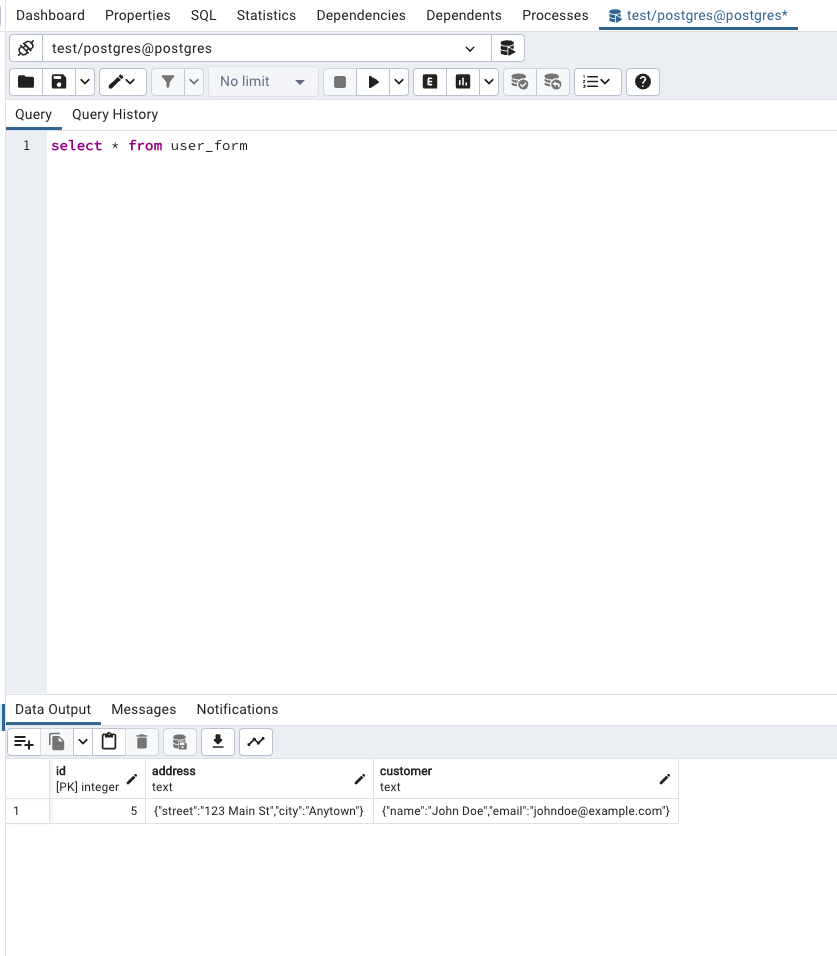

# QmF1cGFsIGNvZGluZyBjaGFsbGVuZ2Uu

# Installation:

1 - To start the express backend server on the port 3000 run:
```bash
yarn local:watch
```

2 - To start the Postgres database on the port 5432 run:
```bash
docker-compose up
```

3 - Manually create the database "test" in the PG Admin (http://localhost:5050/ password: admin) before running:
`ts-node src/setUpDatabase.ts` to sync/create the tables.

# Endpoints
## GET form structure
http://localhost:3000/forms/structure/userForm

## POST insert form data
```bash
curl --location --request POST 'http://localhost:3000/forms/userForm' \
--header 'Content-Type: application/json' \
--data-raw '{
    "data": {
        "id": "123456",
        "address": {
            "street": "123 Main St",
            "city": "Anytown"
        },
        "customer": {
            "name": "John Doe",
            "email": "johndoe@example.com"
        }
    }
}'
```

To check the data inserted you can see on pgAdmin (http://localhost:5050/ password: admin):




# Todos
There are many things left for improvement, but I tried to keep it simple and focus on the main points.
Ideally this project would have test coverage (unit and integration), linting, the express process would run inside docker, etc...

# Overall explanation
As one of the requirements is `keep in mind that this system needs to be built for scale` I decided to opt here for the hexagonal architecture.
This means, today the endpoints works with Express and Postgres , but in the future we could easily change the framework or the database (adapters) without affecting the core business logic (Application useCase).